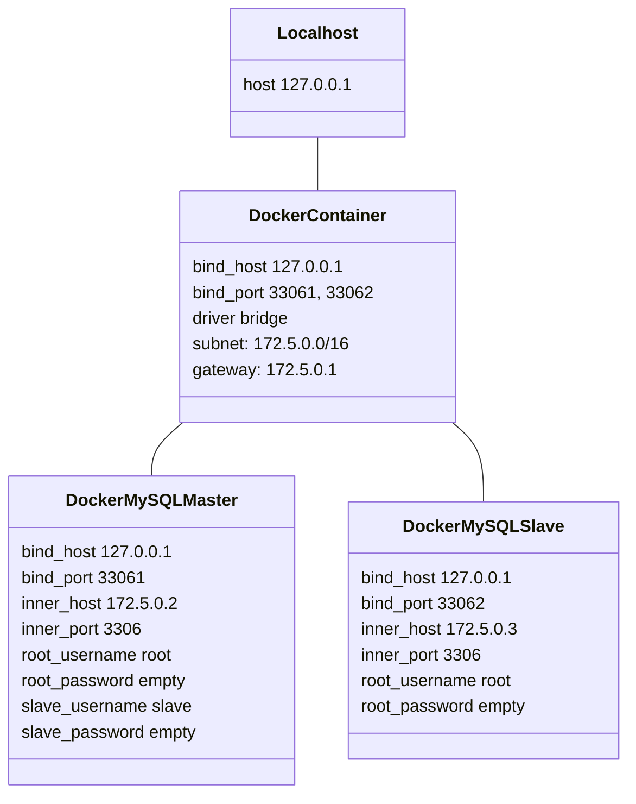

# MySQL Replication

## Docker Structure



## Run Docker Compose

```zsh
docker-compose up --build -d
```

## Set Replication Slave into Master

- create local DB

```sql
-- master DB(root@172.5.0.2)

CREATE DATABASE IF NOT EXISTS `local`;
```

- create slave user

```sql
-- master DB(root@172.5.0.2)

CREATE USER 'master'@'%' IDENTIFIED BY 'master_password';
GRANT ALL PRIVILEGES ON `local`.* TO 'master'@'%';

FLUSH PRIVILEGES;
```

- create replica user

```sql
-- master DB(root@172.5.0.2)

CREATE USER 'repl'@'%';
GRANT REPLICATION SLAVE ON *.* TO 'repl'@'%';

FLUSH PRIVILEGES;

SHOW MASTER STATUS;
```

## Set Replication Source into Slave

- create slave user

```sql
-- slave DB(root@172.5.0.3)

CREATE USER 'slave'@'%' IDENTIFIED BY 'slave_password';
GRANT ALL PRIVILEGES ON `local`.* TO 'slave'@'%';

FLUSH PRIVILEGES;
```

- start replica

```sql
-- slave DB(root@172.5.0.3)
CHANGE REPLICATION SOURCE TO
  SOURCE_HOST='172.5.0.2',
  SOURCE_LOG_FILE='mysql-bin.000003',
  SOURCE_LOG_POS=591,
  SOURCE_SSL=0;

START REPLICA USER='repl' PASSWORD='';

SHOW REPLICA STATUS;
```
