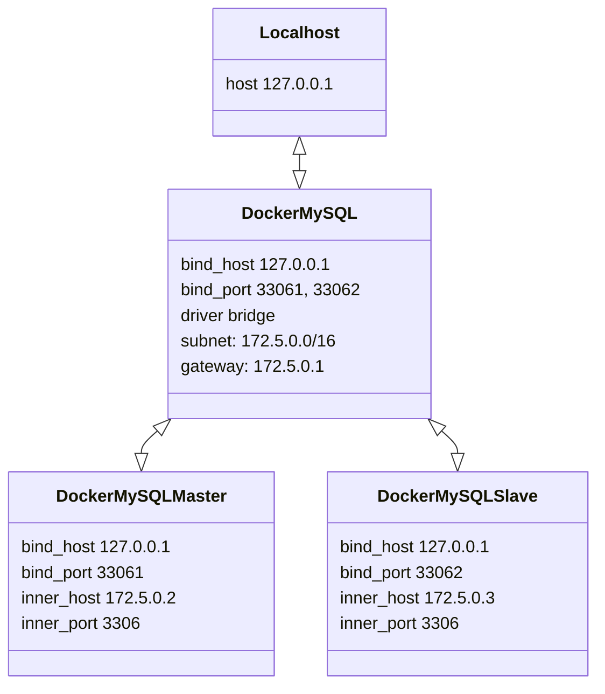

# MySQL Replication

## Docker Structure



## Run Docker Compose

```zsh
docker-compose up --build -d
```

## Set Replication Slave into Master

```sql
-- master DB(root@172.5.0.2)

CREATE USER 'slave'@'172.5.0.3';
GRANT REPLICATION SLAVE ON *.* TO 'slave'@'172.5.0.3';

SHOW MASTER STATUS;
```

## Set Replication Source into Slave

```sql
-- slave DB(root@172.5.0.3)

CHANGE REPLICATION SOURCE TO
  SOURCE_HOST='172.5.0.2',
  SOURCE_LOG_FILE={{ MASTER_STATUS_TABLE_FILE_FIELD }},
  SOURCE_LOG_POS={{ MASTER_STATUS_TABLE_POSITION_FIELD }},
  SOURCE_SSL=0;

START REPLICA USER='slave' PASSWORD='';

SHOW REPLICA STATUS;
```
